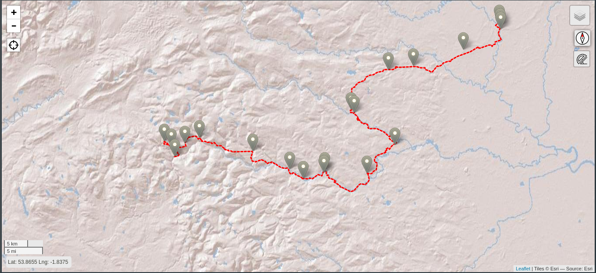

# Explorin'

In planning an upcoming trip, I realised I don't actually want a full map to be distracted by.  I just want a line to follow.

I want a virtual version of the old GPS devices that had really limited memory, but also to reproduce the experiences of old-school explorers

## Made With

* [Leaflet](https://leafletjs.com/)
* [Leaflet Coordinates](https://github.com/MrMufflon/Leaflet.Coordinates)
* [Leaflet Compass](https://github.com/stefanocudini/leaflet-compass)
* [Leaflet GPS](https://github.com/stefanocudini/leaflet-gps)
* [Leaflet Ruler](https://github.com/gokertanrisever/leaflet-ruler)
* [Leaflet Omnivore](https://github.com/mapbox/leaflet-omnivore)
* [Indiana Jones Adventure Color Palette](https://www.color-hex.com/color-palette/13932)
* GitHub Pages

## Data Sources

Base layer:

* [ESRI World Shaded Relief](https://www.arcgis.com/home/item.html?id=9c5370d0b54f4de1b48a3792d7377ff2)

Cheat layers:

* [CartoDB Positron (no labels)](https://carto.com/blog/getting-to-know-positron-and-dark-matter/)
* [ESRI World Imagery](https://www.arcgis.com/home/item.html?id=10df2279f9684e4a9f6a7f08febac2a9)
